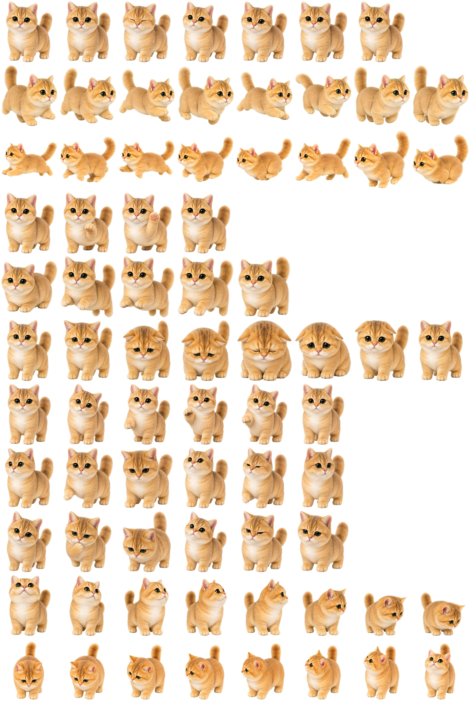

<p align="center">
  
</p>

<h1 align="center">团团桌宠</h1>

在没有安装 Codex、没有安装 .NET、没有联网的 Windows 电脑上，运行兼容 Hatch Pet v2
素材的透明桌面宠物。

团团桌宠将 Codex Pet 的动画图集和主要桌面交互移植为独立 Windows 应用。程序内置
“团团”，并支持导入、切换由照片、插画或角色设定生成的新宠物。

> Codex 不是运行本程序的前置条件。只有在希望根据参考图自动制作新宠物素材时，才需要
> Codex 和仓库内附带的 Skill。

## 团团预览

<p align="center">
  
</p>

<p align="center">
  <sub>内置团团的完整 Hatch Pet v2 动画图集，包含待机、走动、互动、跳跃和视线跟随动作。</sub>
</p>

## 下载

- [直接下载 v1.2.1：TuantuanDesktopPet.exe](https://github.com/Guhhe/tuantuan-desktop-pet/releases/download/v1.2.1/TuantuanDesktopPet.exe)
- [查看全部版本与更新说明](../../releases)
- [下载 SHA-256 校验文件](../../releases/latest/download/SHA256SUMS.txt)

支持 Windows 10 22H2 / Windows 11 x64。发布包是自包含单文件 EXE，无需管理员权限，
也无需预先安装 .NET。

当前版本：**1.2.1**

> 发布文件暂未进行商业代码签名。首次从网络下载时，Windows SmartScreen 可能显示
> “Windows 已保护你的电脑”；请核对 Release 来源和 SHA-256 后再运行。

## 功能

- 无边框透明桌宠、透明区域点击穿透、无任务栏和 Alt+Tab 项。
- 待机、眨眼、呼吸、左右散步、挥爪、跳跃和 16 方位鼠标视线跟随。
- 待机轮播复用图集中的玩爪、环顾、好奇、委屈/困倦和挥爪动作。
- 单击触发随机互动，双击跳跃，按住拖动；拖动时根据方向播放左右移动画。
- 50%–200% 尺寸滑杆和数字输入，首次运行默认 75%。
- 鼠标跟随、自主走动、始终置顶、全屏自动隐藏均可独立开关。
- 多显示器与 Per-Monitor V2 DPI，显示器或分辨率变化后自动回到有效工作区。
- 当前用户开机启动，无需管理员权限。
- 导入 `.ttpet`、`.zip` 或成对的 `pet.json` + `spritesheet.webp`。
- 内置团团始终可恢复；导入宠物可设为下次启动时的默认宠物。
- 单实例运行、离线工作，不包含遥测、更新器或网络请求。

## 快速开始

1. 从 [GitHub Releases](../../releases/latest) 下载 `TuantuanDesktopPet.exe`。
2. 将 EXE 放到一个不会频繁移动的位置，例如：

   ```text
   C:\Users\<你的用户名>\Applications\TuantuanDesktopPet.exe
   ```

3. 双击运行。团团默认出现在主屏幕右下角。
4. 右键团团或系统托盘图标打开设置菜单。

首次运行默认开启置顶、鼠标跟随、自主走动、全屏自动隐藏和开机启动。移动 EXE 后，
再次手动运行一次即可修正开机启动路径。

### 操作

| 操作 | 行为 |
| --- | --- |
| 单击宠物 | 随机播放挥爪、玩爪、环顾或好奇动作 |
| 双击宠物 | 跳跃 |
| 按住并拖动 | 移动宠物；按拖动方向播放左右移动画 |
| 右键宠物 | 打开托盘菜单 |
| 双击托盘图标 | 唤回当前宠物 |

### 托盘菜单

- **默认宠物**：导入新宠物，或在团团与已导入宠物之间切换。
- **暂停**：停止自主动画和行为。
- **始终置顶**：控制宠物是否保持在普通窗口上方。
- **跟随鼠标**：静止时根据鼠标相对位置切换 16 个视线方向。
- **自主走动**：控制随机左右散步；关闭后仍可拖动。
- **尺寸**：通过滑杆或数字框设置 50%–200%。
- **开机启动**：写入当前用户的 Windows Run 注册表项。
- **全屏自动隐藏**：检测到其他应用全屏时隐藏并暂停。
- **重置位置**：回到主屏幕右下角。

## 导入新宠物

在托盘菜单中选择 **默认宠物 → 导入新宠物…**，然后选择以下任一形式：

- 推荐：`<pet-id>.ttpet`
- 兼容：结构相同的 `.zip`
- 文件对：同一目录下的 `pet.json` 与 `spritesheet.webp`

导入成功后会立即切换并保存为默认宠物。程序会先验证包结构、元数据、WebP、尺寸、
Alpha 通道、所有必需格和透明保留格；无效素材不会写入宠物目录。

导入数据保存在：

```text
%LOCALAPPDATA%\TuantuanDesktopPet\
  settings.json
  pets\
    <pet-id>\
      pet.json
      spritesheet.webp
```

程序原样复制导入的 WebP 字节。解码帧和透明度掩码只存在于内存，不会创建 PNG、
缩略图或图片缓存。

## 使用参考图制作新宠物

仓库包含完整的 Codex Skill：

```text
skills/
  hatch-desktop-pet/   # 团团桌宠打包、验证与导入格式
  hatch-pet/           # Hatch Pet v2 动画生成、组装与视觉 QA
```

制作素材时需要 Codex 的图片生成能力；制作完成后的 `.ttpet` 可以交给任何安装了团团
桌宠的 Windows 用户，对方不需要 Codex。

### 安装 Skill

将两个目录复制到 Codex 的个人 Skill 目录，然后重启 Codex：

```powershell
$SkillRoot = Join-Path $env:USERPROFILE ".codex\skills"
New-Item -ItemType Directory -Force $SkillRoot | Out-Null
Copy-Item -Recurse -Force .\skills\hatch-pet (Join-Path $SkillRoot "hatch-pet")
Copy-Item -Recurse -Force .\skills\hatch-desktop-pet (Join-Path $SkillRoot "hatch-desktop-pet")
```

macOS / Linux：

```bash
mkdir -p ~/.codex/skills
cp -R skills/hatch-pet ~/.codex/skills/
cp -R skills/hatch-desktop-pet ~/.codex/skills/
```

### 生成流程

1. 在 Codex 中上传一张或多张清晰参考图。
2. 使用类似请求：

   ```text
   $hatch-desktop-pet 根据这张照片制作一个名为“土豆”的团团桌宠导入包。
   ```

3. Skill 会生成并检查完整的 8×11 动画图集、16 个视线方向、透明度和动作连续性。
4. 最终得到：

   ```text
   <pet-id>.ttpet
   <pet-id>/
     pet.json
     spritesheet.webp
   <pet-id>.validation.json
   ```

5. 将 `.ttpet` 复制到 Windows 电脑，通过托盘菜单导入。

参考图建议、完整步骤、质量检查和常见失败处理见
[使用 Codex 制作新宠物](docs/CREATE_PET_WITH_CODEX.md)。

## 宠物素材规范

每个宠物需要：

- `spritesheet.webp`：1536×2288、RGBA、8 列×11 行、每格 192×208。
- `pet.json`：宠物 id、显示名称、描述和 `spriteVersionNumber: 2`。

各行动画及有效帧数：

| 行 | 动画 | 有效列数 |
| ---: | --- | ---: |
| 0 | 待机 / 眨眼 / 呼吸 | 6 |
| 1 | 向右移动 | 8 |
| 2 | 向左移动 | 8 |
| 3 | 挥爪 | 4 |
| 4 | 跳跃 | 5 |
| 5 | 委屈 / 困倦待机 | 8 |
| 6 | 玩爪待机 | 6 |
| 7 | 环顾待机 | 6 |
| 8 | 好奇待机 | 6 |
| 9 | 000°–157.5° 视线方向 | 8 |
| 10 | 180°–337.5° 视线方向 | 8 |

每行有效列之后的保留格必须完全透明。详细契约和 `pet.json` 示例见
[宠物包格式](docs/PET_PACKAGE.md)。

## 从源码构建

### 环境

- Windows 10/11 x64
- [.NET 10 SDK](https://dotnet.microsoft.com/download/dotnet/10.0)
- PowerShell 7 或 Windows PowerShell

### 构建命令

```powershell
git clone <你的仓库地址>
cd tuantuan-desktop-pet
.\build.ps1
```

脚本会：

1. 校验内置团团 WebP 的 SHA-256 和 `pet.json`；
2. 运行全部单元测试；
3. 发布 `win-x64` 自包含单文件；
4. 生成：

   ```text
   dist\
     团团桌宠.exe
     SHA256SUMS.txt
   ```

`dist/*.exe` 被 `.gitignore` 排除，因为自包含 EXE 超过 GitHub 普通 Git 的 100 MB
单文件限制。GitHub Actions 会为每个版本标签构建并上传 Release 文件。

## 发布版本

维护者推送 `v*` 标签即可触发 Release：

```bash
git tag v1.2.1
git push origin v1.2.1
```

CI 会在 Windows runner 上测试和构建，并将 Windows 可执行文件和 `SHA256SUMS.txt`
上传到对应 GitHub Release。详见 [发布说明](docs/RELEASING.md)。

## 项目结构

```text
assets/                    内置团团宠物包
docs/                      使用、格式和发布文档
skills/                    新宠物生成与验证 Skill
src/TuantuanDesktopPet/    WPF 应用
src/TuantuanDesktopPet.Core/
tests/                     xUnit 测试
.github/                   CI、Release、Issue 和 PR 模板
build.ps1                  可复现的 Windows 发布脚本
```

## 隐私与安全

- 应用不联网、不收集遥测、不检查更新。
- 开机启动只写入当前用户的
  `HKCU\Software\Microsoft\Windows\CurrentVersion\Run`。
- 导入包在落盘前进行大小、路径、ZIP 结构、JSON、WebP 和单元格校验。
- 请仅从可信来源下载 EXE 和宠物包，并核对 Release 中的 SHA-256。

安全问题请不要公开披露，处理方式见 [SECURITY.md](SECURITY.md)。

## 参与贡献

欢迎提交 bug、功能建议、文档完善和兼容宠物包。开始前请阅读
[CONTRIBUTING.md](CONTRIBUTING.md) 和 [行为准则](CODE_OF_CONDUCT.md)。

## 许可证与致谢

- 应用源码采用 [MIT License](LICENSE)。
- `$hatch-pet` Skill 保留其目录中的 Apache License 2.0。
- 团团及其他宠物美术素材不自动适用 MIT，详见 [素材许可说明](assets/README.md)。
- WebP 解码使用 [SkiaSharp](https://github.com/mono/SkiaSharp)，详见
  [THIRD-PARTY-NOTICES.txt](THIRD-PARTY-NOTICES.txt)。

Codex 是可选的宠物制作工具，不是应用运行依赖。本项目与 OpenAI 不存在官方隶属或背书关系。
