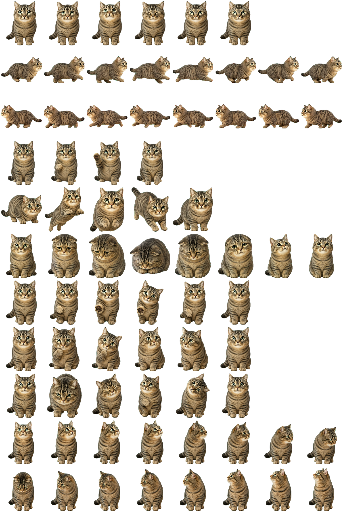

# 土豆示例宠物

“土豆”是根据猫咪参考照片制作的 Hatch Pet v2 示例，也是团团桌宠动态导入功能的
完整样例。

  

## 文件

| 文件 | 用途 |
| --- | --- |
| [`tudou-tabby.ttpet`](tudou-tabby.ttpet?raw=1) | 推荐使用，可直接通过团团桌宠导入 |
| [`pet.json`](pet.json) | 宠物 id、显示名称、描述及图集版本 |
| [`spritesheet.webp`](spritesheet.webp) | 1536×2288、8×11 的 Hatch Pet v2 动画图集 |
| [`SHA256SUMS.txt`](SHA256SUMS.txt) | 三个文件的 SHA-256 校验值 |

`.ttpet` 内部只包含 `pet.json` 和 `spritesheet.webp`，因此也可以把本目录中的文件对
用于调试团团桌宠的兼容导入流程。

## 导入

1. 下载 [`tudou-tabby.ttpet`](tudou-tabby.ttpet?raw=1)。
2. 在 Windows 上启动团团桌宠。
3. 右键桌宠或托盘图标。
4. 选择 **默认宠物 → 导入新宠物…**。
5. 选择下载的 `tudou-tabby.ttpet`。

导入成功后，土豆会立即出现并被设为默认宠物。切换宠物不会覆盖应用内置的团团素材。

## 格式检查

- 宠物 id：`tudou-tabby`
- 显示名称：`土豆`
- 图集尺寸：1536×2288
- 网格：8 列×11 行
- 单元格：192×208
- `spriteVersionNumber`：2
- 包结构：根目录仅含 `pet.json` 和 `spritesheet.webp`

该包已经通过团团桌宠格式验证，包括 WebP 解码、Alpha 通道、必需动画格和透明保留格。

## 素材许可

土豆的参考照片及由其制作的宠物素材由项目维护者提供并授权作为本项目的示例、测试素材
和官方构建配套内容使用。除非权利人另行授权，不授予将这些美术素材拆出后用于其他产品、
训练数据、商标或独立商业素材包的权利。
